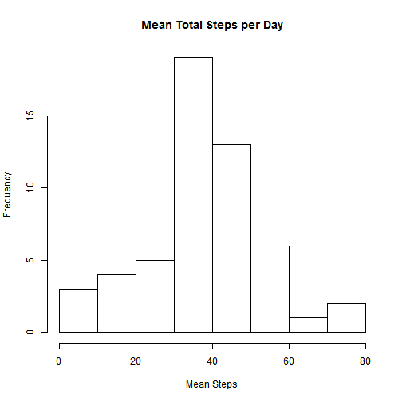
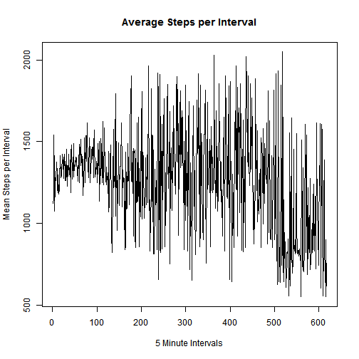
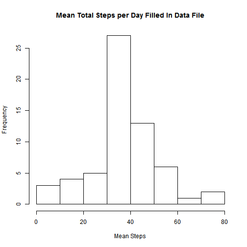
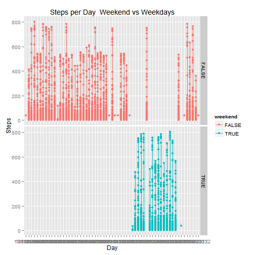

# Reproducible Research: Peer Assessment 1
========================================================
## Loading and preprocessing the data

Read in file - activity monitoring data file from assignment page

```r
activity<-read.csv("activity.csv")
```


## What is mean total number of steps taken per day?
This is a calculation of the mean total steps taken during each day


```r
meanstepsday<-tapply(activity$steps,activity$date, mean)
meanstepsday
```

```
##  10/1/2012 10/10/2012 10/11/2012 10/12/2012 10/13/2012 10/14/2012 
##         NA    34.3750    35.7778    60.3542    43.1458    52.4236 
## 10/15/2012 10/16/2012 10/17/2012 10/18/2012 10/19/2012  10/2/2012 
##    35.2049    52.3750    46.7083    34.9167    41.0729     0.4375 
## 10/20/2012 10/21/2012 10/22/2012 10/23/2012 10/24/2012 10/25/2012 
##    36.0938    30.6285    46.7361    30.9653    29.0104     8.6528 
## 10/26/2012 10/27/2012 10/28/2012 10/29/2012  10/3/2012 10/30/2012 
##    23.5347    35.1354    39.7847    17.4236    39.4167    34.0938 
## 10/31/2012  10/4/2012  10/5/2012  10/6/2012  10/7/2012  10/8/2012 
##    53.5208    42.0694    46.1597    53.5417    38.2465         NA 
##  10/9/2012  11/1/2012 11/10/2012 11/11/2012 11/12/2012 11/13/2012 
##    44.4826         NA         NA    43.7778    37.3785    25.4722 
## 11/14/2012 11/15/2012 11/16/2012 11/17/2012 11/18/2012 11/19/2012 
##         NA     0.1424    18.8924    49.7882    52.4653    30.6979 
##  11/2/2012 11/20/2012 11/21/2012 11/22/2012 11/23/2012 11/24/2012 
##    36.8056    15.5278    44.3993    70.9271    73.5903    50.2708 
## 11/25/2012 11/26/2012 11/27/2012 11/28/2012 11/29/2012  11/3/2012 
##    41.0903    38.7569    47.3819    35.3576    24.4688    36.7049 
## 11/30/2012  11/4/2012  11/5/2012  11/6/2012  11/7/2012  11/8/2012 
##         NA         NA    36.2465    28.9375    44.7326    11.1771 
##  11/9/2012 
##         NA
```

This is a histogram showing the mean steps taken each day

```r
 hist(meanstepsday, main="Mean Total Steps per Day", xlab="Mean Steps")
```

 

This is a calculation of the median steps taken each day

```r
medianstepsday<-tapply(activity$steps,activity$date, median)
medianstepsday
```

```
##  10/1/2012 10/10/2012 10/11/2012 10/12/2012 10/13/2012 10/14/2012 
##         NA          0          0          0          0          0 
## 10/15/2012 10/16/2012 10/17/2012 10/18/2012 10/19/2012  10/2/2012 
##          0          0          0          0          0          0 
## 10/20/2012 10/21/2012 10/22/2012 10/23/2012 10/24/2012 10/25/2012 
##          0          0          0          0          0          0 
## 10/26/2012 10/27/2012 10/28/2012 10/29/2012  10/3/2012 10/30/2012 
##          0          0          0          0          0          0 
## 10/31/2012  10/4/2012  10/5/2012  10/6/2012  10/7/2012  10/8/2012 
##          0          0          0          0          0         NA 
##  10/9/2012  11/1/2012 11/10/2012 11/11/2012 11/12/2012 11/13/2012 
##          0         NA         NA          0          0          0 
## 11/14/2012 11/15/2012 11/16/2012 11/17/2012 11/18/2012 11/19/2012 
##         NA          0          0          0          0          0 
##  11/2/2012 11/20/2012 11/21/2012 11/22/2012 11/23/2012 11/24/2012 
##          0          0          0          0          0          0 
## 11/25/2012 11/26/2012 11/27/2012 11/28/2012 11/29/2012  11/3/2012 
##          0          0          0          0          0          0 
## 11/30/2012  11/4/2012  11/5/2012  11/6/2012  11/7/2012  11/8/2012 
##         NA         NA          0          0          0          0 
##  11/9/2012 
##         NA
```

## What is the average daily activity pattern?

This is a calculation of of the average number of steps per 5 minute interval

```r
meanstepsinterval<-tapply(activity$interval, activity$steps,mean)
meanstepsinterval
```

```
##      0      1      2      3      4      5      6      7      8      9 
## 1121.4 1148.6 1540.0 1298.3 1074.2 1240.6 1320.8 1262.2 1376.1 1300.7 
##     10     11     12     13     14     15     16     17     18     19 
## 1214.8 1189.0 1298.0 1181.1 1204.3 1337.1 1337.9 1416.6 1281.4 1289.3 
##     20     21     22     23     24     25     26     27     28     29 
## 1301.2 1425.5 1356.8 1330.8 1407.4 1273.5 1424.1 1339.4 1263.7 1261.8 
##     30     31     32     33     34     35     36     37     38     39 
## 1455.3 1335.5 1229.3 1355.5 1289.7 1421.4 1354.2 1296.7 1388.7 1379.0 
##     40     41     42     43     44     45     46     47     48     49 
## 1187.9 1426.5 1480.5 1270.9 1349.5 1322.0 1487.4 1281.9 1358.3 1321.5 
##     50     51     52     53     54     55     56     57     58     59 
## 1366.7 1404.3 1377.0 1402.4 1291.7 1342.1 1258.0 1289.1 1417.0 1248.3 
##     60     61     62     63     64     65     66     67     68     69 
## 1484.0 1419.8 1516.0 1354.8 1385.6 1422.0 1403.6 1171.2 1394.6 1221.9 
##     70     71     72     73     74     75     76     77     78     79 
## 1419.8 1525.8 1344.7 1248.5 1537.0 1380.8 1460.6 1613.7 1314.2 1386.1 
##     80     81     82     83     84     85     86     87     88     89 
## 1396.1 1280.8 1522.9 1423.5 1248.0 1354.6 1382.1 1452.5 1391.1 1467.2 
##     90     91     92     93     94     95     96     97     98     99 
## 1414.6 1520.7 1279.3 1571.7 1527.5 1284.2 1338.6 1299.5 1381.2 1285.0 
##    100    101    102    103    104    105    106    107    108    109 
## 1248.8 1487.1 1302.9 1396.5 1503.1 1134.4 1338.3 1293.1 1520.7 1338.1 
##    110    111    112    113    114    115    116    117    118    119 
## 1489.3 1247.3 1623.0 1319.2 1235.5 1584.2 1502.0 1377.0 1372.5 1253.1 
##    120    121    122    123    124    125    126    127    128    129 
## 1346.9 1235.0 1286.4 1274.3 1184.4 1440.0 1070.0 1116.7 1426.0 1320.0 
##    130    131    132    133    134    135    136    137    138    139 
## 1478.3 1046.7  877.5 1020.0  820.0 1249.0 1576.7 1220.0 1286.4 1224.3 
##    140    141    142    143    144    145    146    147    148    149 
## 1635.0 1045.0 1793.3 1219.5 1262.0  956.7 1285.6 1305.0 1494.3 1108.3 
##    150    151    152    153    154    155    156    157    158    159 
## 1265.0 1272.5 1426.7 1350.0 1613.8 1330.0 1100.0 1326.2 1223.0 1279.2 
##    160    161    162    163    164    165    166    167    168    170 
## 1273.8 1080.0  840.0 1438.0  853.3 1315.0 1232.5 1092.5 1488.8 1255.6 
##    171    172    173    174    175    176    177    178    179    180 
## 1300.0 1407.1 1112.5 1527.9 1585.0 1750.0 1905.0 1258.8 1254.2 1302.5 
##    181    182    183    184    185    186    187    188    189    190 
## 1441.7  923.3 1458.3 1431.7 1451.7  920.0  850.0 1397.5 1125.0 1129.3 
##    191    192    193    194    195    196    197    198    199    200 
## 1615.0 1135.0 1192.0 1650.0  855.0 1335.0 1070.0 1441.2 1038.3 1597.5 
##    201    202    203    204    205    206    207    208    209    210 
## 1805.0 1025.0 1185.8 1436.7 1400.0 1030.0 1086.7 1102.5 1215.0 1400.0 
##    211    212    213    214    216    219    221    223    224    225 
## 1170.0 1115.0 1420.0 1420.0 1125.0 1965.0 1077.5 1463.8  830.0 1025.0 
##    229    230    231    232    235    236    237    238    240    241 
##  945.0 1250.0 1822.5 1263.3 1010.0 1535.0 1372.5  815.0  815.0 1147.5 
##    242    243    244    245    247    248    249    250    251    252 
## 1332.5 1113.3 1135.0 1205.0 1323.3  840.0 1920.0 1765.0  655.0 1380.0 
##    253    254    255    256    257    258    259    260    261    262 
##  835.0 1910.0  820.0 1655.0 1230.0 1605.0  845.0 1442.1 1255.0 1567.5 
##    263    264    265    266    267    269    270    271    272    274 
## 1765.0 1530.0  855.0 1112.5 1310.0 1075.0 1145.0 1705.0 1850.0 1382.5 
##    275    276    277    279    280    281    282    283    284    285 
## 1213.3 1475.0 1311.2 1683.3  752.5 1424.0 1437.5 1462.5 1077.5 1560.0 
##    286    287    289    290    291    292    293    294    295    297 
## 1249.0 1720.0 1345.0 1582.5 1275.0 1280.0 1177.5 1570.0 1805.0 1900.0 
##    298    299    301    302    303    304    305    306    307    308 
## 1568.0 1820.0  925.0 1610.0 1210.0 1740.0 1505.0 1341.7 1810.0 1487.5 
##    309    310    311    312    313    314    315    316    317    318 
## 1355.0 1688.8 1613.3 1127.5 1135.0 1500.0  840.0 1382.5 1017.5 1845.0 
##    319    320    321    322    323    324    325    326    327    328 
## 1295.0 1105.0 1178.3 1437.5  832.5 1572.5 1745.0 1375.0  715.0 1122.5 
##    330    331    332    333    334    335    336    339    340    341 
## 1370.0 1050.0 1311.7  650.0 1376.2 1358.3 1720.0 1105.0 1187.5 1325.0 
##    343    344    345    346    347    349    350    351    353    354 
## 1112.5  810.0 1091.7 1255.0 1605.0 1755.0 1425.0 1487.5 1915.0 1500.0 
##    355    356    357    358    359    360    361    362    363    364 
##  855.0 1110.0 1845.0  908.3 1550.0 1455.0 1247.5  985.0  900.0 1292.5 
##    365    366    368    370    371    372    373    374    375    376 
## 1545.0 1433.3 1655.0 1815.0 1296.7  755.0 1430.0 1292.5 1740.0 1210.0 
##    377    378    380    384    385    387    388    389    391    392 
## 1258.8 1420.0 1365.0 1515.0  855.0 1445.0 1200.0 1591.7 1365.0 1405.0 
##    393    394    395    396    397    399    400    401    402    403 
## 1190.0 1220.0 1456.7 2027.5 1245.0 1442.5 1090.0 1280.0 1687.5 1256.7 
##    404    405    406    408    410    411    412    413    414    415 
## 1073.3 1315.0 1487.5 1137.5 1855.0 1397.5 1565.0 1200.0 1375.0 1133.3 
##    416    417    418    419    421    422    423    424    425    426 
## 1205.0 1145.0  921.7 1415.0 1400.0 1650.0  835.0  830.0 1705.0 1905.0 
##    427    428    429    431    432    433    434    435    436    437 
## 1640.0 1325.0 1167.5 1155.0 1667.5 1240.0 1840.0 1537.5  655.0 1867.5 
##    439    440    441    442    443    444    446    449    450    451 
## 1690.0 1080.0 1365.0  645.0 1202.5 1300.0 1081.2  850.0 1057.5 1428.3 
##    453    454    456    457    458    459    461    462    463    464 
## 1548.3 1690.0 1210.0 1962.5 1205.0 1835.0  920.0 1677.5 1406.2 1705.0 
##    465    466    467    468    469    470    471    472    473    474 
## 1480.0 1067.5 1855.0 1496.0 1412.5  835.0 1405.0 1280.0 1632.5  825.0 
##    475    476    477    478    479    480    481    482    483    484 
## 1180.0 1368.8 1410.0  850.0 1385.0 2020.0 1840.0 1743.3 1377.5 1905.0 
##    485    486    487    488    489    490    491    492    493    494 
## 1351.2 1432.5 1377.5 1233.3 1390.0 1855.0 1332.5 1610.0 1770.0 1543.3 
##    495    496    497    498    499    500    501    503    504    505 
## 1335.0 1043.3  875.0 1230.0  965.0 1310.0 1885.0 1335.0 1541.7 1200.0 
##    506    507    508    509    510    511    512    513    514    515 
## 1568.3 1010.0 1145.0 1056.7 1225.0 1306.7 1171.7 1332.5  850.0 1525.0 
##    516    517    518    519    520    521    522    523    524    526 
## 1467.5 1393.3 1380.0  996.7 1580.0 1245.0 1124.0 1490.0 1432.5 1325.0 
##    527    528    529    530    531    532    533    534    535    536 
## 1272.5 1295.0 1617.0  875.0 1810.0 1640.0 1215.0  941.7 1630.0  910.0 
##    537    539    540    541    542    544    545    546    547    548 
##  910.0  900.0 1022.0 1412.5  852.5  880.0 1400.0 1397.5 1815.0  900.0 
##    549    551    553    555    556    559    562    567    568    569 
## 1155.0 1035.0 1915.0 1062.5  810.0  730.0  625.0 1935.0  885.0  645.0 
##    571    573    574    577    581    584    591    592    594    597 
##  850.0  825.0  640.0 1500.0 1845.0  745.0 2050.0  910.0  700.0 1650.0 
##    600    602    606    608    611    612    613    614    618    619 
##  645.0  920.0  945.0  840.0  610.0  630.0  690.0  820.0  825.0  810.0 
##    625    628    630    634    635    637    638    639    643    652 
##  905.0  555.0  750.0 1555.0  835.0  615.0  935.0 1645.0  820.0  696.7 
##    655    659    662    665    667    668    679    680    681    682 
##  855.0  732.5 1455.0  850.0  830.0  900.0  815.0  822.5 1550.0  910.0 
##    686    687    690    693    697    698    701    706    708    709 
##  905.0  815.0  835.0  800.0  830.0  845.0  840.0  772.5  835.0  550.0 
##    710    713    714    715    717    718    720    721    725    726 
## 1510.0  887.5  735.0 1342.5  715.0  705.0  835.0  948.8 1605.0 1235.0 
##    727    729    730    731    732    733    734    735    736    737 
##  820.0 1135.0 1540.0  685.0  870.0 1217.5  855.0  832.5  820.0 1275.0 
##    738    739    741    742    743    744    745    746    747    748 
##  715.0  775.0  845.0  963.3  821.7 1177.5  840.0 1240.0 1020.0  830.0 
##    749    750    751    752    753    754    755    756    757    758 
## 1167.5 1126.7  720.0 1615.0 1262.5 1270.0 1100.0  935.0  741.2 1080.0 
##    759    760    765    766    767    768    769    770    777    781 
## 1182.5 1525.0 1610.0  850.0  605.0 1605.0 1555.0 1021.7  555.0  850.0 
##    783    785    786    789    794    802    806 
## 1140.0 1386.7  835.0  720.0  550.0  900.0  615.0
```

```r
plot(meanstepsinterval, type="l",main="Average Steps per Interval",ylab="Mean Steps per Interval", xlab="5 Minute Intervals")
```

 

Calculate maximum steps in an interval

```r
maxstepsinterval<-tapply(activity$interval, activity$steps,max)
max(maxstepsinterval)
```

```
## [1] 2355
```


## Imputing missing values
Calculate number of missing values - shown in this summary as the number of NA's

```r
summary(activity)
```

```
##      steps               date          interval   
##  Min.   :  0.0   10/1/2012 :  288   Min.   :   0  
##  1st Qu.:  0.0   10/10/2012:  288   1st Qu.: 589  
##  Median :  0.0   10/11/2012:  288   Median :1178  
##  Mean   : 37.4   10/12/2012:  288   Mean   :1178  
##  3rd Qu.: 12.0   10/13/2012:  288   3rd Qu.:1766  
##  Max.   :806.0   10/14/2012:  288   Max.   :2355  
##  NA's   :2304    (Other)   :15840
```

To replace NA's in the data I did the following:
I calculated the mean of "non NA steps" in the data

```r
meansteps<-mean(activity$steps, na.rm=TRUE)
meansteps
```

```
## [1] 37.38
```

Create new data file and replace NA values with mean of steps to fill in missing data
Show sample of 500 with NA changed to 37.38

```r
activity2 <- activity
activity2[is.na(activity2 <- activity)] <- meansteps
head(activity2[200:700,],500)
```

```
##      steps      date interval
## 200  37.38 10/1/2012     1635
## 201  37.38 10/1/2012     1640
## 202  37.38 10/1/2012     1645
## 203  37.38 10/1/2012     1650
## 204  37.38 10/1/2012     1655
## 205  37.38 10/1/2012     1700
## 206  37.38 10/1/2012     1705
## 207  37.38 10/1/2012     1710
## 208  37.38 10/1/2012     1715
## 209  37.38 10/1/2012     1720
## 210  37.38 10/1/2012     1725
## 211  37.38 10/1/2012     1730
## 212  37.38 10/1/2012     1735
## 213  37.38 10/1/2012     1740
## 214  37.38 10/1/2012     1745
## 215  37.38 10/1/2012     1750
## 216  37.38 10/1/2012     1755
## 217  37.38 10/1/2012     1800
## 218  37.38 10/1/2012     1805
## 219  37.38 10/1/2012     1810
## 220  37.38 10/1/2012     1815
## 221  37.38 10/1/2012     1820
## 222  37.38 10/1/2012     1825
## 223  37.38 10/1/2012     1830
## 224  37.38 10/1/2012     1835
## 225  37.38 10/1/2012     1840
## 226  37.38 10/1/2012     1845
## 227  37.38 10/1/2012     1850
## 228  37.38 10/1/2012     1855
## 229  37.38 10/1/2012     1900
## 230  37.38 10/1/2012     1905
## 231  37.38 10/1/2012     1910
## 232  37.38 10/1/2012     1915
## 233  37.38 10/1/2012     1920
## 234  37.38 10/1/2012     1925
## 235  37.38 10/1/2012     1930
## 236  37.38 10/1/2012     1935
## 237  37.38 10/1/2012     1940
## 238  37.38 10/1/2012     1945
## 239  37.38 10/1/2012     1950
## 240  37.38 10/1/2012     1955
## 241  37.38 10/1/2012     2000
## 242  37.38 10/1/2012     2005
## 243  37.38 10/1/2012     2010
## 244  37.38 10/1/2012     2015
## 245  37.38 10/1/2012     2020
## 246  37.38 10/1/2012     2025
## 247  37.38 10/1/2012     2030
## 248  37.38 10/1/2012     2035
## 249  37.38 10/1/2012     2040
## 250  37.38 10/1/2012     2045
## 251  37.38 10/1/2012     2050
## 252  37.38 10/1/2012     2055
## 253  37.38 10/1/2012     2100
## 254  37.38 10/1/2012     2105
## 255  37.38 10/1/2012     2110
## 256  37.38 10/1/2012     2115
## 257  37.38 10/1/2012     2120
## 258  37.38 10/1/2012     2125
## 259  37.38 10/1/2012     2130
## 260  37.38 10/1/2012     2135
## 261  37.38 10/1/2012     2140
## 262  37.38 10/1/2012     2145
## 263  37.38 10/1/2012     2150
## 264  37.38 10/1/2012     2155
## 265  37.38 10/1/2012     2200
## 266  37.38 10/1/2012     2205
## 267  37.38 10/1/2012     2210
## 268  37.38 10/1/2012     2215
## 269  37.38 10/1/2012     2220
## 270  37.38 10/1/2012     2225
## 271  37.38 10/1/2012     2230
## 272  37.38 10/1/2012     2235
## 273  37.38 10/1/2012     2240
## 274  37.38 10/1/2012     2245
## 275  37.38 10/1/2012     2250
## 276  37.38 10/1/2012     2255
## 277  37.38 10/1/2012     2300
## 278  37.38 10/1/2012     2305
## 279  37.38 10/1/2012     2310
## 280  37.38 10/1/2012     2315
## 281  37.38 10/1/2012     2320
## 282  37.38 10/1/2012     2325
## 283  37.38 10/1/2012     2330
## 284  37.38 10/1/2012     2335
## 285  37.38 10/1/2012     2340
## 286  37.38 10/1/2012     2345
## 287  37.38 10/1/2012     2350
## 288  37.38 10/1/2012     2355
## 289   0.00 10/2/2012        0
## 290   0.00 10/2/2012        5
## 291   0.00 10/2/2012       10
## 292   0.00 10/2/2012       15
## 293   0.00 10/2/2012       20
## 294   0.00 10/2/2012       25
## 295   0.00 10/2/2012       30
## 296   0.00 10/2/2012       35
## 297   0.00 10/2/2012       40
## 298   0.00 10/2/2012       45
## 299   0.00 10/2/2012       50
## 300   0.00 10/2/2012       55
## 301   0.00 10/2/2012      100
## 302   0.00 10/2/2012      105
## 303   0.00 10/2/2012      110
## 304   0.00 10/2/2012      115
## 305   0.00 10/2/2012      120
## 306   0.00 10/2/2012      125
## 307   0.00 10/2/2012      130
## 308   0.00 10/2/2012      135
## 309   0.00 10/2/2012      140
## 310   0.00 10/2/2012      145
## 311   0.00 10/2/2012      150
## 312   0.00 10/2/2012      155
## 313   0.00 10/2/2012      200
## 314   0.00 10/2/2012      205
## 315   0.00 10/2/2012      210
## 316   0.00 10/2/2012      215
## 317   0.00 10/2/2012      220
## 318   0.00 10/2/2012      225
## 319   0.00 10/2/2012      230
## 320   0.00 10/2/2012      235
## 321   0.00 10/2/2012      240
## 322   0.00 10/2/2012      245
## 323   0.00 10/2/2012      250
## 324   0.00 10/2/2012      255
## 325   0.00 10/2/2012      300
## 326   0.00 10/2/2012      305
## 327   0.00 10/2/2012      310
## 328   0.00 10/2/2012      315
## 329   0.00 10/2/2012      320
## 330   0.00 10/2/2012      325
## 331   0.00 10/2/2012      330
## 332   0.00 10/2/2012      335
## 333   0.00 10/2/2012      340
## 334   0.00 10/2/2012      345
## 335   0.00 10/2/2012      350
## 336   0.00 10/2/2012      355
## 337   0.00 10/2/2012      400
## 338   0.00 10/2/2012      405
## 339   0.00 10/2/2012      410
## 340   0.00 10/2/2012      415
## 341   0.00 10/2/2012      420
## 342   0.00 10/2/2012      425
## 343   0.00 10/2/2012      430
## 344   0.00 10/2/2012      435
## 345   0.00 10/2/2012      440
## 346   0.00 10/2/2012      445
## 347   0.00 10/2/2012      450
## 348   0.00 10/2/2012      455
## 349   0.00 10/2/2012      500
## 350   0.00 10/2/2012      505
## 351   0.00 10/2/2012      510
## 352   0.00 10/2/2012      515
## 353   0.00 10/2/2012      520
## 354   0.00 10/2/2012      525
## 355   0.00 10/2/2012      530
## 356   0.00 10/2/2012      535
## 357   0.00 10/2/2012      540
## 358   0.00 10/2/2012      545
## 359   0.00 10/2/2012      550
## 360   0.00 10/2/2012      555
## 361   0.00 10/2/2012      600
## 362   0.00 10/2/2012      605
## 363   0.00 10/2/2012      610
## 364   0.00 10/2/2012      615
## 365   0.00 10/2/2012      620
## 366   0.00 10/2/2012      625
## 367   0.00 10/2/2012      630
## 368   0.00 10/2/2012      635
## 369   0.00 10/2/2012      640
## 370   0.00 10/2/2012      645
## 371   0.00 10/2/2012      650
## 372   0.00 10/2/2012      655
## 373   0.00 10/2/2012      700
## 374   0.00 10/2/2012      705
## 375   0.00 10/2/2012      710
## 376   0.00 10/2/2012      715
## 377   0.00 10/2/2012      720
## 378   0.00 10/2/2012      725
## 379   0.00 10/2/2012      730
## 380   0.00 10/2/2012      735
## 381   0.00 10/2/2012      740
## 382   0.00 10/2/2012      745
## 383   0.00 10/2/2012      750
## 384   0.00 10/2/2012      755
## 385   0.00 10/2/2012      800
## 386   0.00 10/2/2012      805
## 387   0.00 10/2/2012      810
## 388   0.00 10/2/2012      815
## 389   0.00 10/2/2012      820
## 390   0.00 10/2/2012      825
## 391   0.00 10/2/2012      830
## 392   0.00 10/2/2012      835
## 393   0.00 10/2/2012      840
## 394   0.00 10/2/2012      845
## 395   0.00 10/2/2012      850
## 396   0.00 10/2/2012      855
## 397   0.00 10/2/2012      900
## 398   0.00 10/2/2012      905
## 399   0.00 10/2/2012      910
## 400   0.00 10/2/2012      915
## 401   0.00 10/2/2012      920
## 402   0.00 10/2/2012      925
## 403   0.00 10/2/2012      930
## 404   0.00 10/2/2012      935
## 405   0.00 10/2/2012      940
## 406   0.00 10/2/2012      945
## 407   0.00 10/2/2012      950
## 408   0.00 10/2/2012      955
## 409   0.00 10/2/2012     1000
## 410   0.00 10/2/2012     1005
## 411   0.00 10/2/2012     1010
## 412   0.00 10/2/2012     1015
## 413   0.00 10/2/2012     1020
## 414   0.00 10/2/2012     1025
## 415   0.00 10/2/2012     1030
## 416   0.00 10/2/2012     1035
## 417   0.00 10/2/2012     1040
## 418   0.00 10/2/2012     1045
## 419   0.00 10/2/2012     1050
## 420   0.00 10/2/2012     1055
## 421   0.00 10/2/2012     1100
## 422   0.00 10/2/2012     1105
## 423   0.00 10/2/2012     1110
## 424   0.00 10/2/2012     1115
## 425   0.00 10/2/2012     1120
## 426   0.00 10/2/2012     1125
## 427   0.00 10/2/2012     1130
## 428   0.00 10/2/2012     1135
## 429   0.00 10/2/2012     1140
## 430   0.00 10/2/2012     1145
## 431   0.00 10/2/2012     1150
## 432   0.00 10/2/2012     1155
## 433   0.00 10/2/2012     1200
## 434   0.00 10/2/2012     1205
## 435   0.00 10/2/2012     1210
## 436   0.00 10/2/2012     1215
## 437   0.00 10/2/2012     1220
## 438   0.00 10/2/2012     1225
## 439   0.00 10/2/2012     1230
## 440   0.00 10/2/2012     1235
## 441   0.00 10/2/2012     1240
## 442   0.00 10/2/2012     1245
## 443   0.00 10/2/2012     1250
## 444   0.00 10/2/2012     1255
## 445   0.00 10/2/2012     1300
## 446   0.00 10/2/2012     1305
## 447   0.00 10/2/2012     1310
## 448   0.00 10/2/2012     1315
## 449   0.00 10/2/2012     1320
## 450   0.00 10/2/2012     1325
## 451   0.00 10/2/2012     1330
## 452   0.00 10/2/2012     1335
## 453   0.00 10/2/2012     1340
## 454   0.00 10/2/2012     1345
## 455   0.00 10/2/2012     1350
## 456   0.00 10/2/2012     1355
## 457   0.00 10/2/2012     1400
## 458   0.00 10/2/2012     1405
## 459   0.00 10/2/2012     1410
## 460   0.00 10/2/2012     1415
## 461   0.00 10/2/2012     1420
## 462   0.00 10/2/2012     1425
## 463   0.00 10/2/2012     1430
## 464   0.00 10/2/2012     1435
## 465   0.00 10/2/2012     1440
## 466   0.00 10/2/2012     1445
## 467   0.00 10/2/2012     1450
## 468   0.00 10/2/2012     1455
## 469   0.00 10/2/2012     1500
## 470   0.00 10/2/2012     1505
## 471   0.00 10/2/2012     1510
## 472   0.00 10/2/2012     1515
## 473   0.00 10/2/2012     1520
## 474   0.00 10/2/2012     1525
## 475   0.00 10/2/2012     1530
## 476   0.00 10/2/2012     1535
## 477   0.00 10/2/2012     1540
## 478   0.00 10/2/2012     1545
## 479   0.00 10/2/2012     1550
## 480   0.00 10/2/2012     1555
## 481   0.00 10/2/2012     1600
## 482   0.00 10/2/2012     1605
## 483   0.00 10/2/2012     1610
## 484   0.00 10/2/2012     1615
## 485   0.00 10/2/2012     1620
## 486   0.00 10/2/2012     1625
## 487   0.00 10/2/2012     1630
## 488   0.00 10/2/2012     1635
## 489   0.00 10/2/2012     1640
## 490   0.00 10/2/2012     1645
## 491   0.00 10/2/2012     1650
## 492   0.00 10/2/2012     1655
## 493   0.00 10/2/2012     1700
## 494   0.00 10/2/2012     1705
## 495   0.00 10/2/2012     1710
## 496   0.00 10/2/2012     1715
## 497   0.00 10/2/2012     1720
## 498   0.00 10/2/2012     1725
## 499   0.00 10/2/2012     1730
## 500   0.00 10/2/2012     1735
## 501   0.00 10/2/2012     1740
## 502   0.00 10/2/2012     1745
## 503   0.00 10/2/2012     1750
## 504   0.00 10/2/2012     1755
## 505   0.00 10/2/2012     1800
## 506   0.00 10/2/2012     1805
## 507   0.00 10/2/2012     1810
## 508   0.00 10/2/2012     1815
## 509   0.00 10/2/2012     1820
## 510   0.00 10/2/2012     1825
## 511   0.00 10/2/2012     1830
## 512   0.00 10/2/2012     1835
## 513   0.00 10/2/2012     1840
## 514   0.00 10/2/2012     1845
## 515   0.00 10/2/2012     1850
## 516   0.00 10/2/2012     1855
## 517   0.00 10/2/2012     1900
## 518   0.00 10/2/2012     1905
## 519   0.00 10/2/2012     1910
## 520   0.00 10/2/2012     1915
## 521   0.00 10/2/2012     1920
## 522   0.00 10/2/2012     1925
## 523   0.00 10/2/2012     1930
## 524   0.00 10/2/2012     1935
## 525   0.00 10/2/2012     1940
## 526   0.00 10/2/2012     1945
## 527   0.00 10/2/2012     1950
## 528   0.00 10/2/2012     1955
## 529   0.00 10/2/2012     2000
## 530   0.00 10/2/2012     2005
## 531   0.00 10/2/2012     2010
## 532   0.00 10/2/2012     2015
## 533   0.00 10/2/2012     2020
## 534   0.00 10/2/2012     2025
## 535   0.00 10/2/2012     2030
## 536   0.00 10/2/2012     2035
## 537   0.00 10/2/2012     2040
## 538   0.00 10/2/2012     2045
## 539   0.00 10/2/2012     2050
## 540   0.00 10/2/2012     2055
## 541   0.00 10/2/2012     2100
## 542   0.00 10/2/2012     2105
## 543   0.00 10/2/2012     2110
## 544   0.00 10/2/2012     2115
## 545   0.00 10/2/2012     2120
## 546   0.00 10/2/2012     2125
## 547   0.00 10/2/2012     2130
## 548   0.00 10/2/2012     2135
## 549   0.00 10/2/2012     2140
## 550   0.00 10/2/2012     2145
## 551   0.00 10/2/2012     2150
## 552   0.00 10/2/2012     2155
## 553   0.00 10/2/2012     2200
## 554   0.00 10/2/2012     2205
## 555 117.00 10/2/2012     2210
## 556   9.00 10/2/2012     2215
## 557   0.00 10/2/2012     2220
## 558   0.00 10/2/2012     2225
## 559   0.00 10/2/2012     2230
## 560   0.00 10/2/2012     2235
## 561   0.00 10/2/2012     2240
## 562   0.00 10/2/2012     2245
## 563   0.00 10/2/2012     2250
## 564   0.00 10/2/2012     2255
## 565   0.00 10/2/2012     2300
## 566   0.00 10/2/2012     2305
## 567   0.00 10/2/2012     2310
## 568   0.00 10/2/2012     2315
## 569   0.00 10/2/2012     2320
## 570   0.00 10/2/2012     2325
## 571   0.00 10/2/2012     2330
## 572   0.00 10/2/2012     2335
## 573   0.00 10/2/2012     2340
## 574   0.00 10/2/2012     2345
## 575   0.00 10/2/2012     2350
## 576   0.00 10/2/2012     2355
## 577   0.00 10/3/2012        0
## 578   0.00 10/3/2012        5
## 579   0.00 10/3/2012       10
## 580   0.00 10/3/2012       15
## 581   0.00 10/3/2012       20
## 582   0.00 10/3/2012       25
## 583   0.00 10/3/2012       30
## 584   0.00 10/3/2012       35
## 585   0.00 10/3/2012       40
## 586   0.00 10/3/2012       45
## 587   0.00 10/3/2012       50
## 588   0.00 10/3/2012       55
## 589   0.00 10/3/2012      100
## 590   0.00 10/3/2012      105
## 591   0.00 10/3/2012      110
## 592   0.00 10/3/2012      115
## 593   0.00 10/3/2012      120
## 594   0.00 10/3/2012      125
## 595   0.00 10/3/2012      130
## 596   0.00 10/3/2012      135
## 597   0.00 10/3/2012      140
## 598   0.00 10/3/2012      145
## 599   0.00 10/3/2012      150
## 600   0.00 10/3/2012      155
## 601   0.00 10/3/2012      200
## 602   0.00 10/3/2012      205
## 603   0.00 10/3/2012      210
## 604   0.00 10/3/2012      215
## 605   0.00 10/3/2012      220
## 606   0.00 10/3/2012      225
## 607   0.00 10/3/2012      230
## 608   0.00 10/3/2012      235
## 609   0.00 10/3/2012      240
## 610   0.00 10/3/2012      245
## 611   0.00 10/3/2012      250
## 612   0.00 10/3/2012      255
## 613   0.00 10/3/2012      300
## 614   0.00 10/3/2012      305
## 615   0.00 10/3/2012      310
## 616   0.00 10/3/2012      315
## 617   0.00 10/3/2012      320
## 618   0.00 10/3/2012      325
## 619   0.00 10/3/2012      330
## 620   0.00 10/3/2012      335
## 621   0.00 10/3/2012      340
## 622   0.00 10/3/2012      345
## 623   0.00 10/3/2012      350
## 624   0.00 10/3/2012      355
## 625   0.00 10/3/2012      400
## 626   0.00 10/3/2012      405
## 627   4.00 10/3/2012      410
## 628   0.00 10/3/2012      415
## 629   0.00 10/3/2012      420
## 630   0.00 10/3/2012      425
## 631  36.00 10/3/2012      430
## 632   0.00 10/3/2012      435
## 633   0.00 10/3/2012      440
## 634   0.00 10/3/2012      445
## 635   0.00 10/3/2012      450
## 636   0.00 10/3/2012      455
## 637   0.00 10/3/2012      500
## 638   0.00 10/3/2012      505
## 639   0.00 10/3/2012      510
## 640   0.00 10/3/2012      515
## 641   0.00 10/3/2012      520
## 642   0.00 10/3/2012      525
## 643   0.00 10/3/2012      530
## 644  25.00 10/3/2012      535
## 645   0.00 10/3/2012      540
## 646   0.00 10/3/2012      545
## 647  90.00 10/3/2012      550
## 648 411.00 10/3/2012      555
## 649 413.00 10/3/2012      600
## 650 415.00 10/3/2012      605
## 651 519.00 10/3/2012      610
## 652 529.00 10/3/2012      615
## 653 613.00 10/3/2012      620
## 654 562.00 10/3/2012      625
## 655 612.00 10/3/2012      630
## 656 534.00 10/3/2012      635
## 657 323.00 10/3/2012      640
## 658 600.00 10/3/2012      645
## 659 533.00 10/3/2012      650
## 660 251.00 10/3/2012      655
## 661  56.00 10/3/2012      700
## 662   0.00 10/3/2012      705
## 663  32.00 10/3/2012      710
## 664  80.00 10/3/2012      715
## 665  10.00 10/3/2012      720
## 666   9.00 10/3/2012      725
## 667 145.00 10/3/2012      730
## 668  46.00 10/3/2012      735
## 669   0.00 10/3/2012      740
## 670  44.00 10/3/2012      745
## 671 126.00 10/3/2012      750
## 672  42.00 10/3/2012      755
## 673 138.00 10/3/2012      800
## 674  53.00 10/3/2012      805
## 675   0.00 10/3/2012      810
## 676   0.00 10/3/2012      815
## 677  22.00 10/3/2012      820
## 678  57.00 10/3/2012      825
## 679 161.00 10/3/2012      830
## 680  19.00 10/3/2012      835
## 681  15.00 10/3/2012      840
## 682   0.00 10/3/2012      845
## 683  16.00 10/3/2012      850
## 684   0.00 10/3/2012      855
## 685   0.00 10/3/2012      900
## 686   8.00 10/3/2012      905
## 687   0.00 10/3/2012      910
## 688  51.00 10/3/2012      915
## 689 516.00 10/3/2012      920
## 690 245.00 10/3/2012      925
## 691   0.00 10/3/2012      930
## 692 161.00 10/3/2012      935
## 693   7.00 10/3/2012      940
## 694   0.00 10/3/2012      945
## 695   0.00 10/3/2012      950
## 696   0.00 10/3/2012      955
## 697   0.00 10/3/2012     1000
## 698   0.00 10/3/2012     1005
## 699   0.00 10/3/2012     1010
```

Calculate mean and median for filled in data file 

```r
newmeanstepsday<-tapply(activity2$steps,activity2$date, mean)
newmeanstepsday
```

```
##  10/1/2012 10/10/2012 10/11/2012 10/12/2012 10/13/2012 10/14/2012 
##    37.3826    34.3750    35.7778    60.3542    43.1458    52.4236 
## 10/15/2012 10/16/2012 10/17/2012 10/18/2012 10/19/2012  10/2/2012 
##    35.2049    52.3750    46.7083    34.9167    41.0729     0.4375 
## 10/20/2012 10/21/2012 10/22/2012 10/23/2012 10/24/2012 10/25/2012 
##    36.0938    30.6285    46.7361    30.9653    29.0104     8.6528 
## 10/26/2012 10/27/2012 10/28/2012 10/29/2012  10/3/2012 10/30/2012 
##    23.5347    35.1354    39.7847    17.4236    39.4167    34.0938 
## 10/31/2012  10/4/2012  10/5/2012  10/6/2012  10/7/2012  10/8/2012 
##    53.5208    42.0694    46.1597    53.5417    38.2465    37.3826 
##  10/9/2012  11/1/2012 11/10/2012 11/11/2012 11/12/2012 11/13/2012 
##    44.4826    37.3826    37.3826    43.7778    37.3785    25.4722 
## 11/14/2012 11/15/2012 11/16/2012 11/17/2012 11/18/2012 11/19/2012 
##    37.3826     0.1424    18.8924    49.7882    52.4653    30.6979 
##  11/2/2012 11/20/2012 11/21/2012 11/22/2012 11/23/2012 11/24/2012 
##    36.8056    15.5278    44.3993    70.9271    73.5903    50.2708 
## 11/25/2012 11/26/2012 11/27/2012 11/28/2012 11/29/2012  11/3/2012 
##    41.0903    38.7569    47.3819    35.3576    24.4688    36.7049 
## 11/30/2012  11/4/2012  11/5/2012  11/6/2012  11/7/2012  11/8/2012 
##    37.3826    37.3826    36.2465    28.9375    44.7326    11.1771 
##  11/9/2012 
##    37.3826
```

This is a histogram showing the mean steps taken each day for the filled in data file

```r
 hist(newmeanstepsday, main="Mean Total Steps per Day Filled In Data File", xlab="Mean Steps")
```

 

This is a calculation of the median steps taken each day in the filled in data file

```r
newmedianstepsday<-tapply(activity2$steps,activity2$date, median)
newmedianstepsday
```

```
##  10/1/2012 10/10/2012 10/11/2012 10/12/2012 10/13/2012 10/14/2012 
##      37.38       0.00       0.00       0.00       0.00       0.00 
## 10/15/2012 10/16/2012 10/17/2012 10/18/2012 10/19/2012  10/2/2012 
##       0.00       0.00       0.00       0.00       0.00       0.00 
## 10/20/2012 10/21/2012 10/22/2012 10/23/2012 10/24/2012 10/25/2012 
##       0.00       0.00       0.00       0.00       0.00       0.00 
## 10/26/2012 10/27/2012 10/28/2012 10/29/2012  10/3/2012 10/30/2012 
##       0.00       0.00       0.00       0.00       0.00       0.00 
## 10/31/2012  10/4/2012  10/5/2012  10/6/2012  10/7/2012  10/8/2012 
##       0.00       0.00       0.00       0.00       0.00      37.38 
##  10/9/2012  11/1/2012 11/10/2012 11/11/2012 11/12/2012 11/13/2012 
##       0.00      37.38      37.38       0.00       0.00       0.00 
## 11/14/2012 11/15/2012 11/16/2012 11/17/2012 11/18/2012 11/19/2012 
##      37.38       0.00       0.00       0.00       0.00       0.00 
##  11/2/2012 11/20/2012 11/21/2012 11/22/2012 11/23/2012 11/24/2012 
##       0.00       0.00       0.00       0.00       0.00       0.00 
## 11/25/2012 11/26/2012 11/27/2012 11/28/2012 11/29/2012  11/3/2012 
##       0.00       0.00       0.00       0.00       0.00       0.00 
## 11/30/2012  11/4/2012  11/5/2012  11/6/2012  11/7/2012  11/8/2012 
##      37.38      37.38       0.00       0.00       0.00       0.00 
##  11/9/2012 
##      37.38
```

These values do differ from the earlier part of the assignment with the missing data.

The median shows values where there were none when values were missing.

The mean values for the filled in data file are greater in frequency than with the missing data file but the contour of the histogram is similar.


## Are there differences in activity patterns between weekdays and weekends?
Find the weekday name for each date and add to datafile

```r
weekdays<-weekdays(as.Date(activity2$date,'%m/%d/%Y'))
activity2days<-cbind(activity2,weekdays)
```

calculate mean steps per interval per day

```r
dailymeansteps<-tapply(activity2days$steps, activity2days$weekdays, mean)
dailymeansteps
```

```
##    Friday    Monday  Saturday    Sunday  Thursday   Tuesday Wednesday 
##     41.69     35.25     42.76     41.97     29.50     31.07     40.54
```
Load timeDate package
Calculate Weekend indicator
Add as column "weekend" to activity2days

```r
library("timeDate")
weekend<-isWeekend(as.Date(activity2$date,'%m/%d/%Y'))
activity2days<-cbind(activity2days,weekend)
activity2days[1425:1450,]
```

```
##      steps      date interval weekdays weekend
## 1425     0 10/5/2012     2240   Friday   FALSE
## 1426     0 10/5/2012     2245   Friday   FALSE
## 1427     0 10/5/2012     2250   Friday   FALSE
## 1428     0 10/5/2012     2255   Friday   FALSE
## 1429     0 10/5/2012     2300   Friday   FALSE
## 1430     0 10/5/2012     2305   Friday   FALSE
## 1431     0 10/5/2012     2310   Friday   FALSE
## 1432     0 10/5/2012     2315   Friday   FALSE
## 1433     0 10/5/2012     2320   Friday   FALSE
## 1434     0 10/5/2012     2325   Friday   FALSE
## 1435     0 10/5/2012     2330   Friday   FALSE
## 1436     0 10/5/2012     2335   Friday   FALSE
## 1437     0 10/5/2012     2340   Friday   FALSE
## 1438     0 10/5/2012     2345   Friday   FALSE
## 1439     0 10/5/2012     2350   Friday   FALSE
## 1440     0 10/5/2012     2355   Friday   FALSE
## 1441     0 10/6/2012        0 Saturday    TRUE
## 1442     0 10/6/2012        5 Saturday    TRUE
## 1443     0 10/6/2012       10 Saturday    TRUE
## 1444     0 10/6/2012       15 Saturday    TRUE
## 1445     0 10/6/2012       20 Saturday    TRUE
## 1446     0 10/6/2012       25 Saturday    TRUE
## 1447     0 10/6/2012       30 Saturday    TRUE
## 1448     0 10/6/2012       35 Saturday    TRUE
## 1449     0 10/6/2012       40 Saturday    TRUE
## 1450     0 10/6/2012       45 Saturday    TRUE
```

Calculate mean steps per day
Plot for weekend vs weekdays

```r
library(ggplot2)
```

```
## Warning: package 'ggplot2' was built under R version 3.0.3
```

```r
 g<-qplot(activity2days$date, activity2days$steps, data=activity2days, color=weekend, facets=weekend~.,xlab=("Day"),ylab=("Steps"), main=("Steps per Day  Weekend vs Weekdays"))+geom_line()
g
```

 


 


 
   


